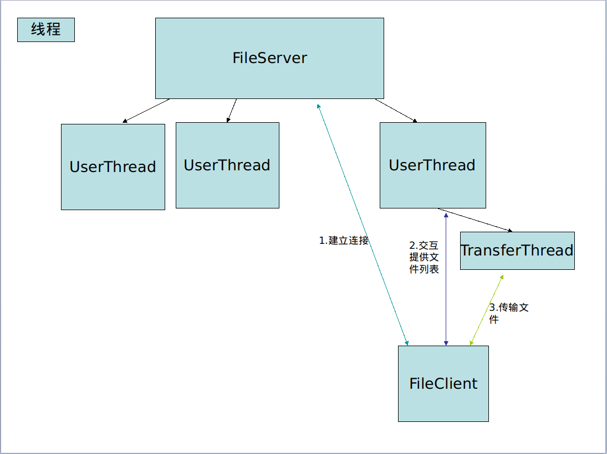

# filetransfer
自己实现的C/S文件传输程序，包含简单的登录验证，传输文件，服务器与客户端使用TCP协议进行交互，使用UDP协议，以二进制的形式分块传输文件。

* ftp.FileServer 服务器
  * UserThread 用户交互线程
* ftp.FileClient 客户端
* ftp.Instructions 基本指令
* ftp.FileTransfer UDP协议接收与发送文件
* ftp.FileUtils 文件分解和合并工具
* ftp.DgramUtils UDP数据包和文件块的转换工具

